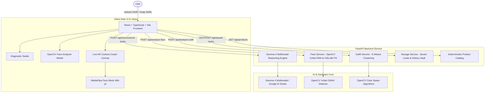

# GlamSync AI

> A Gemma 4 and OpenCV powered personal beauty styling coach that analyzes your outfit, face shape and skin undertone, then guides makeup application through a real-time AR camera mirror.

## Team

**Team Name:** GlamSync AI


| Member             | Contribution                                                                  |
| ------------------ | ----------------------------------------------------------------------------- |
| Neha Saravanan     | Frontend Diagnostic Studio UI, component architecture and Lookbook drawer     |
| Iniyaa Muthuselvan | OpenCV YuNet facial morphology, ITA undertone detection and skin segmentation |
| Bankuru Gurucharan | Gemma 4 multimodal reasoning engine, FastAPI backend and storage vault        |
| Varshini RV        | Real-time MediaPipe 468-point Face Mesh AR camera mirror and voice directives |


## Problem Statement

### The Problem

Finding makeup and styling routines that harmonize with an individual's facial anatomy, skin undertone, and outfit color palette is a persistent challenge. Conventional beauty platforms are either static 2D photo filters, which cannot teach physical application, or generic conversational chatbots, which lack computer vision understanding and spatial awareness. Users are left guessing how to apply products, which colors flatter their undertone, and how to adapt styles to their face shape.

### Why We Chose This Problem

We wanted to bridge the gap between digital AI styling reasoning and real-world physical application. By combining computer vision color science (K-Means and CIELAB ITA) with Gemma 4 multimodal reasoning and live 468-point AR camera coaching, GlamSync AI turns any standard laptop or mobile camera into an interactive personal beauty mirror that coaches the user through each step.

## Solution

GlamSync AI is an end-to-end beauty pipeline. It extracts the colors of the user's outfit with K-Means clustering, detects face shape and skin undertone using OpenCV and the Individual Typology Angle (ITA), and sends both to Gemma 4 to generate 3 curated looks (Natural/Safe, AI Recommendation, Bold Statement) matched to the outfit, occasion, budget and available products. The user then opens a look in a live AR camera mirror that tracks facial landmarks and projects step-by-step application guides on their face, with voice directives. Saved looks and past sessions are kept in a personal vault.

### Key Features

- **K-Means chromatic extraction:** dominant and accent color analysis from uploaded outfit photos or quick presets.
- **OpenCV YuNet facial analysis:** face shape (Oval, Round, Square, Heart, Diamond, Oblong), ITA skin shade and undertone (Warm Golden, Cool Rosy, Neutral, Olive) with interactive AR HUD overlays.
- **Gemma 4 multimodal reasoning:** structured JSON output with 3 tiers of calibrated looks and step-by-step routines.
- **Real-time AR mirror coach:** 468-point MediaPipe Face Mesh tracking with overlays for cheekbones, eyelids, eyeliner wings, lip contours, and complete prep/skincare steps (toner, moisturizer, primer, SPF), plus live voice guidance and a saved looks and session history vault.

## Innovation and Differentiation

Conventional beauty apps rely on static color swatches, 2D image filters and pre-recorded videos, and generic chatbot wrappers give text-only advice with no understanding of the user's face. GlamSync AI combines classical computer vision (K-Means color extraction, YuNet facial morphology, CIELAB ITA skin analysis), a multimodal reasoning model (Gemma 4) and live AR landmark tracking in one pipeline, so recommendations are calibrated to the user's actual outfit and face and are taught step by step on the user's own face. It also has no OpenAI dependency, using local OpenCV algorithms together with Gemma 4 through Google AI Studio.

## Technical Implementation

### Architecture



### Technology Stack


| Category        | Technologies                                                                                    |
| --------------- | ----------------------------------------------------------------------------------------------- |
| Frontend        | React 18, TypeScript, Vite, Tailwind CSS, Lucide Icons, Canvas Confetti                         |
| Backend         | FastAPI, Uvicorn, Pydantic v2, Python                                                           |
| Database        | Local JSON file persistence and browser LocalStorage cache                                      |
| AI / ML         | Gemma 4 multimodal, OpenCV YuNet DNN (`face_detection_yunet_2023mar.onnx`), MediaPipe Face Mesh, OpenCV, NumPy, Pillow |
| Infrastructure  | Local deployment (Node.js and Python), developed on NVIDIA GeForce RTX 5050 Laptop GPU          |
| APIs / Services | Google AI Studio GenAI API, Web Speech Synthesis API, WebRTC MediaDevices                       |


If a category or technology is not implemented in the project, specify `N/A` instead of leaving the field blank.

### How It Works

1. **Outfit chromatic extraction:** the backend resizes the outfit image and applies OpenCV K-Means clustering (k=3) to find dominant and secondary hex colors, luminance and style formality.
2. **OpenCV facial diagnostics:** YuNet detects face boundaries, eye coordinates and mouth width from the selfie. Skin pixels are segmented using combined YCrCb (133 ≤ Cr ≤ 173, 77 ≤ Cb ≤ 127) and HSV masks, and the Individual Typology Angle (ITA°) classifies the skin shade and undertone (warm, cool, neutral or olive).
3. **Gemma 4 multimodal reasoning:** the outfit attributes and facial profile are sent to Gemma 4 with a strict JSON schema prompt to build 3 synchronized beauty looks with product matches and step-by-step instructions.
4. **Live AR mirror guidance:** the webcam stream is mirrored while MediaPipe Face Mesh detects 468 landmarks and projects cheekbone guides, eyelid crease fills, winged eyeliner vectors, lip overlays, and skincare prep steps with voice directives.
5. **Look preservation:** curated looks can be saved to a personal vault, and past sessions are available in the history timeline.

### Technical Decisions

- **Direct HTML5 webcam capture with dual fallback:** the frontend uses `navigator.mediaDevices.getUserMedia` directly, with fallback constraints, instead of third-party camera wrappers, to get instant video feedback and avoid black screens.
- **YuNet ONNX face detection:** we chose OpenCV's lightweight YuNet model (~300 KB) for server-side detection because of its fast inference and accurate 5-point landmark localization.
- **CIELAB ITA colorimetry:** we used the dermatological Individual Typology Angle in CIELAB space for objective skin tone categorization.
- **No OpenAI dependency:** the architecture uses Gemma 4 / Google AI Studio together with local computer vision algorithms, and falls back to deterministic recommendations when no API key is set.

## Implementation During the Hackathon

During the Hack Day event, Team GlamSync AI built the complete end-to-end application architecture:
- Designed and built the React + TypeScript Diagnostic Studio frontend with custom Tailwind styling and lookbook drawer.
- Implemented OpenCV YuNet DNN model integration for lightweight facial morphology and CIELAB Individual Typology Angle (ITA) skin undertone detection.
- Developed the FastAPI backend service with multimodal Gemma 4 recommendation generation and fallback deterministic routines.
- Implemented real-time MediaPipe 468-point Face Mesh AR camera mirror tracking with 19 interactive makeup and skincare application layer overlays and Web Speech API audio directives.

### Team Contributions

- **Neha Saravanan:** Frontend Diagnostic Studio UI, component architecture and Lookbook drawer.
- **Iniyaa Muthuselvan:** OpenCV YuNet facial morphology, ITA undertone detection and skin segmentation.
- **Bankuru Gurucharan:** Gemma 4 multimodal reasoning engine, FastAPI backend and storage vault.
- **Varshini RV:** Real-time MediaPipe 468-point Face Mesh AR camera mirror and voice directives.

## Working Application

**Live Application:** [https://hacktoberfest-hack-day-coimbatore-x.vercel.app](https://hacktoberfest-hack-day-coimbatore-x.vercel.app)

The submitted application is functional and accessible through the link above. Users can upload outfit images, analyze facial morphology and skin undertones, get Gemma 4 recommendations, and use the real-time AR camera mirror coach.

## Demo Video

**Demo Video:** [GlamSync AI Demo Video](https://youtu.be/WVJn0bj-v3U)

Interactive demonstration of GlamSync AI showing outfit chromatic analysis, OpenCV YuNet face shape & ITA skin undertone detection, Gemma 4 multimodal look generation, and real-time MediaPipe AR camera coach mirror.

## Open Source and AI Usage

### AI / Models

- **Gemma 4 (via Google AI Studio):** multimodal reasoning that generates 3 curated looks and step-by-step routines from outfit and facial data.
- **OpenCV YuNet (`face_detection_yunet_2023mar.onnx`):** face detection and 5-point landmark localization.
- **MediaPipe Face Mesh:** 468-point real-time facial landmark tracking for the AR mirror.

### Open Source Components

- **React, TypeScript, Vite, Tailwind CSS:** frontend framework and tooling.
- **FastAPI, Uvicorn, Pydantic:** backend API framework, server and data validation.
- **OpenCV, NumPy, Pillow:** image processing, K-Means clustering and color space conversion.
- **Google AI Studio GenAI API:** access to Gemma 4.

MIT License for open-source component distribution.

## Setup and Usage

### Prerequisites

- Node.js (v18+) and npm
- Python (v3.10+)

### Installation

```bash
git clone https://github.com/guruc1234a-spec/hacktoberfest-hack-day-coimbatore-x-init-club-and-idea-club.git
cd hacktoberfest-hack-day-coimbatore-x-init-club-and-idea-club

# Backend
cd backend
python -m venv venv
# Windows (PowerShell): .\venv\Scripts\Activate.ps1
# Linux/macOS: source venv/bin/activate
pip install -r requirements.txt
cp .env.example .env

# Frontend
cd ../frontend
npm install
```

### Environment Variables

```env
GEMMA_API_KEY=[your-google-ai-studio-key]
```

`GEMMA_API_KEY` is optional. Without it, the backend uses a deterministic fallback.

### Running the Project

```bash
# Terminal 1: backend
cd backend
uvicorn main:app --reload --port 8000

# Terminal 2: frontend
cd frontend
npm run dev
```

### Usage

Open `http://localhost:5173` in your browser, upload an outfit photo or choose a preset, capture a selfie for face analysis, review the 3 generated looks, open one in the live AR mirror and follow the visual and voice guidance. Save favorite looks to your vault to revisit them later.

## Devpost Submission

**Devpost Project:** [Devpost Project URL]

[Add the link to the team's Devpost submission. Ensure the Devpost project page is complete and contains the required project information, links, media, and team details.]

## Credits and License

### Credits

Built by Team GlamSync AI using OpenCV, MediaPipe, FastAPI, React, Google AI Studio and Gemma 4, along with the other open-source libraries listed above.

### License

MIT License. See the [LICENSE](LICENSE) file for details.

## Submission Checklist

- [x] Project title and description added
- [x] All team members listed
- [x] Problem clearly explained
- [x] Reason for choosing the problem explained
- [x] Solution and key features documented
- [x] Innovation and differentiation explained
- [x] Architecture included
- [x] Technical implementation documented
- [x] Work completed during the hackathon documented
- [x] Team contributions documented
- [x] Working application is functional
- [x] Live application link added where applicable
- [x] Demo video added
- [x] AI and open-source components documented
- [x] Setup and usage instructions tested
- [x] Challenges and learnings documented
- [x] Devpost submission completed
- [x] Devpost link added
- [x] Credits added
- [x] License added
- [x] Repository is organized and complete
